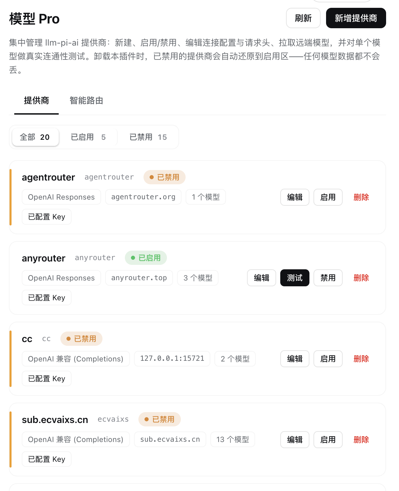
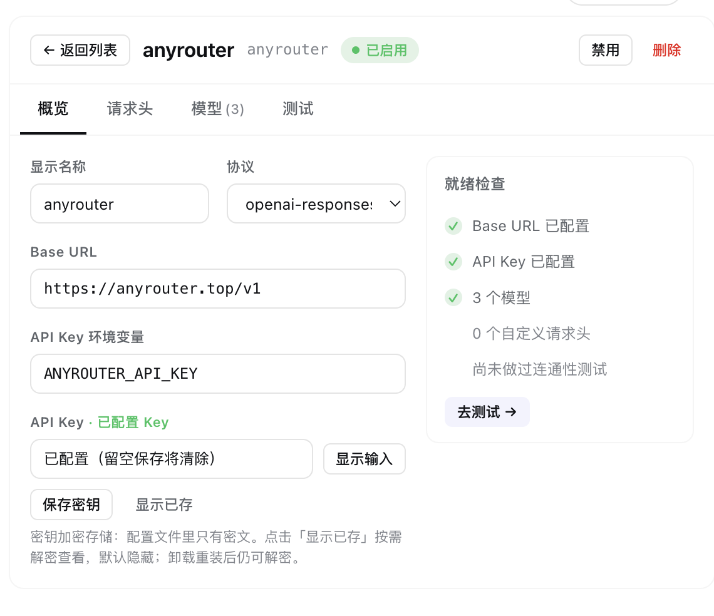
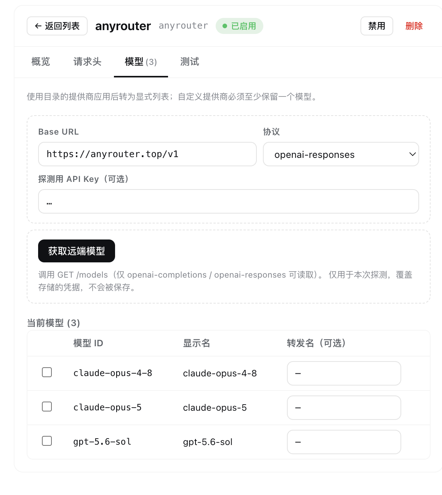
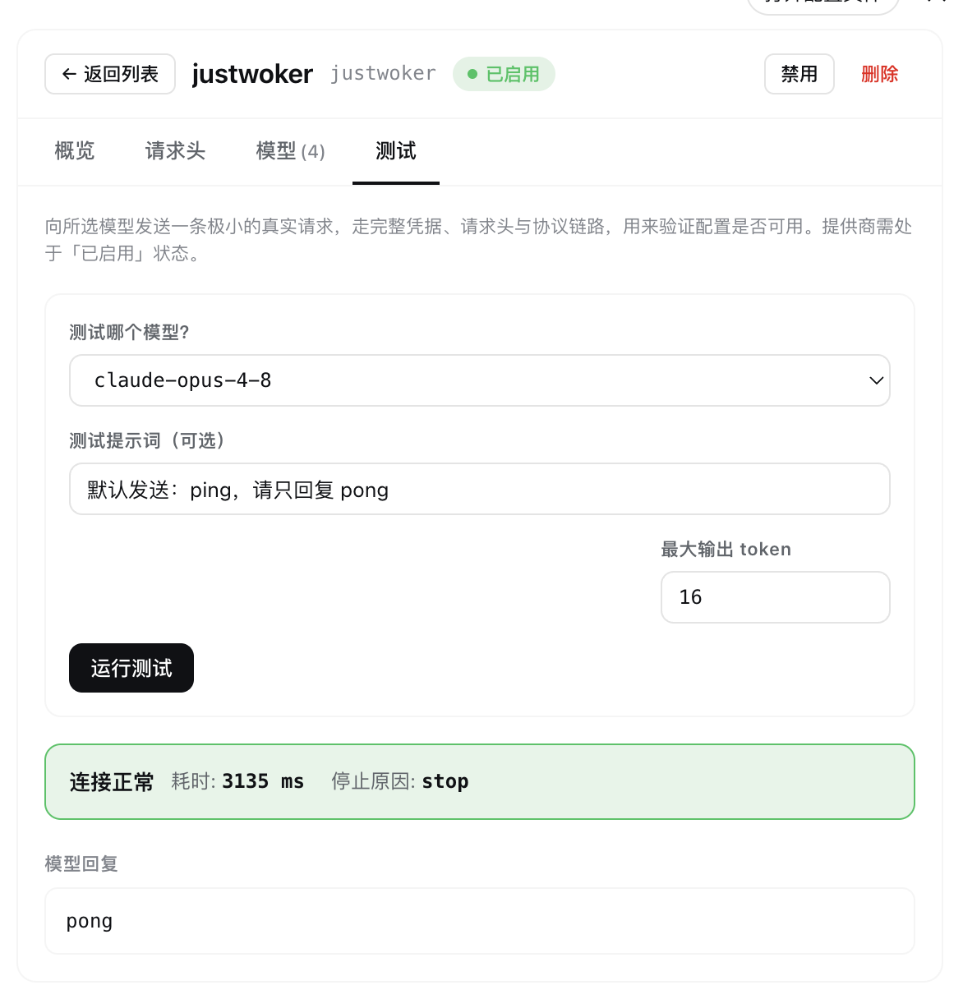
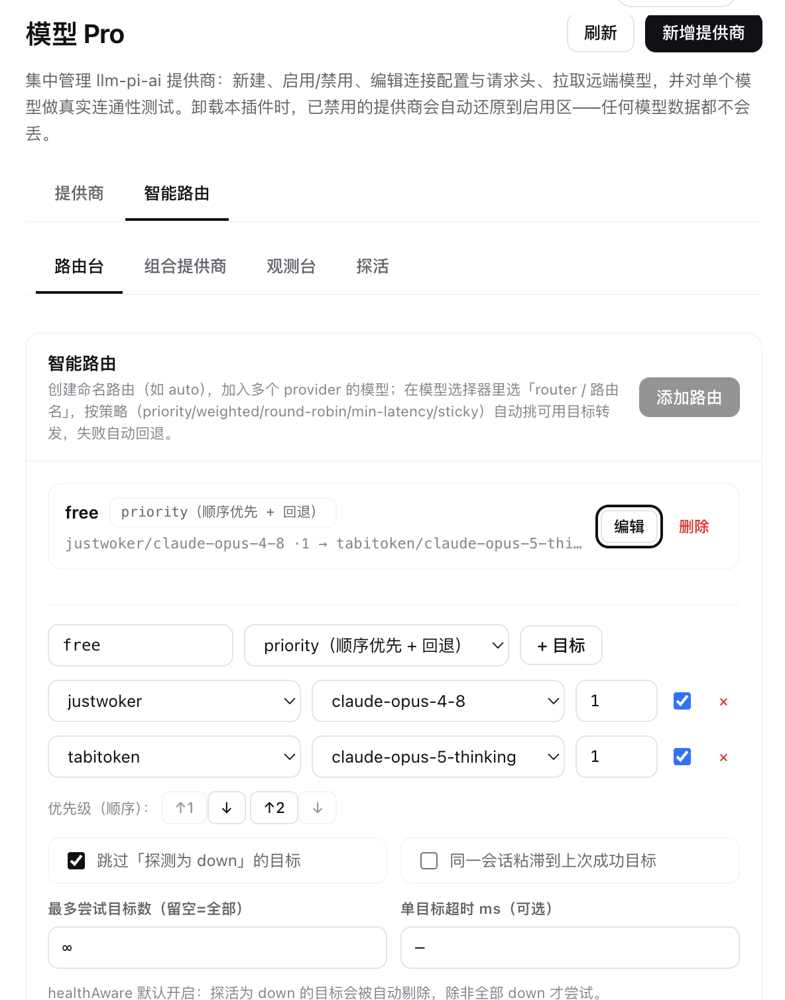

# dsh-model-pro · 模型 Pro

[](https://www.npmjs.com/package/dsh-model-pro)
[](https://opensource.org/licenses/MIT)

面向 [DeepSeek Harness (DSH)](https://github.com/deepseek-ai/dsh) 的动态 Cordis 插件，在设置页新增一个「**模型 Pro**」入口，为 `llm-pi-ai` 提供商提供**全生命周期管理 UI**：新建 / 编辑 / 删除、启用 / 禁用、拉取远端模型、连通性测试、智能路由、组合提供商、观测与探活——并在卸载时**保证模型数据零丢失**。

> 中文文档 · 界面内置中英双语（跟随 DSH 语言设置自动切换）。

---

## ✨ 功能特性（Features）

### 提供商管理
- **提供商 CRUD** — 新建（引导式 3 步向导）、编辑、删除，卡片式列表带状态色条（绿=启用 / 琥珀=禁用）。
- **启用 / 禁用** — 一键切换。禁用的提供商会移入 `disabledProviders`，从模型选择器中隐藏，但配置完整保留。
- **字段编辑** — 逐项编辑 `baseURL`、`api` 协议、`apiKeyEnv`、`displayName`（概览页附「就绪检查」清单）。
- **自定义请求头** — 按提供商增删改 HTTP 请求头（`authorization` / `api-key` 由适配器自动填充，无需手填）。

### 密钥与凭据
- **加密存储** — 在 GUI 中直接粘贴 API Key，以 **AES-256-GCM 加密**写入配置（配置文件只存密文），同时写入 DSH 凭据服务供请求时解析。
- **按需解密查看** — 默认掩码显示，点「显示已存」可解密查看；加密主密钥存于凭据服务且**永不重新生成**，卸载重装后旧密文仍可解密。

### 模型
- **远端模型发现** — 一键 `GET /models` 拉取，支持全选 / 取消全选 / 反选。
- **批量写入模型** — 将选中模型「替换」或「合并」进提供商的显式模型列表。
- **本地转发名映射** — 为某个模型设置「转发名」，选它时实际向 provider 发送映射后的模型名。

### 连通性测试
- **真实连通性测试** —「测试」页对选定模型发起一次极小的真实推理，走完整凭据 / 请求头 / 协议链路，返回**延迟、停止原因与回复内容**，用来在依赖之前确认模型确实可用。

### 智能路由与组合
- **智能路由** — 命名路由（如 `auto`）聚合多个 provider 的模型，支持 **5 种策略**：`priority`（顺序优先+回退）/ `weighted`（按权重随机）/ `round-robin`（平滑加权轮询）/ `min-latency`（历史低延迟优先）/ `sticky`（会话粘滞）。可设每目标权重、启用开关、`healthAware`、会话粘滞、`maxFallbacks`、单目标超时。在模型选择器里选「router / 路由名」即用。
- **组合提供商** — 把多个 provider 的模型合并成一个虚拟 provider，支持**并集 / 交集**两种模式（模型选择器中显示为 `composite / 组合名::模型`）；交集非常适合同款模型多上游互备。

### 观测与健康
- **探活（Probe）** — 对每个目标（`provider + model`）发起真实最小请求，标记 up / down / probing 与连续失败次数；健康感知分发会自动跳过 down 的目标（可按路由关闭）。
- **观测台** — 会话内请求日志（路由 → 目标、延迟、token）与聚合统计（按路由 / 按目标：调用次数、成功率、平均延迟、token 合计），以统计卡与表格呈现。

### 卸载安全（零数据丢失）
- **卸载不丢数据** — 当本插件被卸载或禁用时，会自动把 `disabledProviders` 中的每个提供商**原样还原**回 `providers`，避免模型配置滞留在只有本插件认识的外来键中。详见下文[工作原理](#-工作原理)。

---

## 📸 截图（Screenshots）

> 截图文件放在 [`docs/screenshots/`](docs/screenshots) 目录下。首次使用请自行截图后替换以下占位图。

| 页面 | 说明 |
|------|------|
|  | **仪表盘**：全部 / 已启用 / 已禁用分段（带计数）、引导式 3 步新建向导、状态色条卡片 |
|  | **编辑器**：概览（字段 + 就绪检查）/ 请求头 / 模型 / 测试 四个标签页 |
|  | **模型发现**：拉取远端模型，支持全选 / 反选与批量写入 |
|  | **连通性测试**：对单个模型跑真实推理，显示延迟与回复 |
|  | **智能路由**：路由台 / 组合提供商 / 观测台 / 探活 四个子页 |

---

## 📦 安装教程（Installation）

> DSH 的插件管理命令会转发给 `pnpm`，并要求用 `--profile <name>` 指定目标 Profile（Web GUI 通常是 `web`）。

### 方式一：通过 dsh CLI 安装（推荐）

从 npm 安装（预构建，跳过构建审批）：

```sh
dsh plugin --profile web add dsh-model-pro
```

或直接从 GitHub 安装：

```sh
dsh plugin --profile web add wqy8593521/dsh-model-pro
```

安装后重新打开（或刷新）DSH Web GUI，左侧「设置」中即出现「**模型 Pro**」入口。

### 方式二：作为动态 Cordis 插件运行

本插件也可在 DSH 会话内作为动态插件临时加载：用 `dist/host.js` 与 `dist/client.js` 两半的源码调用 `cordis_define`，再用 `cordis_run` 激活即可。

### 方式三：从源码构建

```sh
git clone https://github.com/wqy8593521/dsh-model-pro.git
cd dsh-model-pro
npm install
npm run build       # 输出 dist/host.js + dist/client.js
npm test            # 运行冒烟测试（可选）
```

---

## 🗑️ 卸载教程（Uninstall）

```sh
dsh plugin --profile web remove dsh-model-pro
```

**卸载是安全的**：插件在卸载 / 禁用时会自行监听自己的卸载事件，把 `disabledProviders` 里的每个提供商（模型、请求头、凭据全部保留）还原回 `providers`。因此**不会有任何提供商或模型配置丢失**。加密 API Key 的主密钥存放在 DSH 凭据服务中、与插件解耦，卸载不会删除它——重装后旧密文仍可正常解密。

> 若只想临时停用而保留定义，用禁用而非卸载即可；两者都会触发同样的还原逻辑。

---

## 🚀 使用教程（Quick Start）

1. **新建提供商** — 进入「模型 Pro」，点右上角「新增提供商」，按 3 步向导填写：
   - **1 · 命名**：`route`（作为模型 ID 前缀，创建后不建议改）+ 可选显示名。
   - **2 · 连接**：选协议（OpenAI 兼容 / OpenAI Responses / Anthropic Messages）+ 填 `Base URL`。
   - **3 · 凭据**：填 API Key 环境变量名，或直接粘贴密钥（加密保存）。
   - 完成后可「创建并测试」或「创建并配置」。
2. **拉取模型** — 进入「模型」标签页，点「获取远端模型」，勾选需要的模型，选「替换为选中」或「合并选中」写入。
3. **连通性测试** — 「测试」标签页选一个模型，点「运行测试」，查看延迟、停止原因与真实回复，确认可用。
4. **智能路由**（可选）— 在「智能路由 → 路由台」新建命名路由，加入多个目标、选策略、设权重；在模型选择器里选「router / 路由名」使用，失败自动回退。
5. **组合提供商**（可选）— 「组合提供商」页选 2 个以上 provider，选并集 / 交集合并其能力；选择器里以「composite / 组合名::模型」使用。
6. **探活与观测**（可选）— 「探活」页对目标发起真实探测更新健康状态；「观测台」查看调用统计与请求日志。

---

## 🔍 工作原理

### 禁用 & 卸载还原
禁用会把提供商配置从 `llm-pi-ai.providers` 移入 `llm-pi-ai.disabledProviders`。由于 `llm-pi-ai` 适配器只解析 `providers` 字典，被禁用的提供商会从模型选择器中消失；schemastery 的非严格对象解析器会在设置校验中保留这个未知键。

因为 `disabledProviders` 是 schema 外来键，Host 半会监听自身卸载（`dispose`，插件被卸载**或**禁用），执行禁用操作的逆运算：把每个被禁用的提供商连同完整档案还原回 `providers`。启用中的提供商不受影响。

### 密钥加密
提供商 API Key 存于两处：**权威副本**在 DSH `credentials` 服务（`llm-pi-ai` 请求时解析）；**静态快照**为 `profile.apiKeyEnc` 下的 AES-256-GCM 密文。随机 AES 主密钥仅生成一次并存入凭据服务，**永不重新生成**，保证重装后旧密文仍可解密。沙箱缺少 WebCrypto 时回退到打包的纯 JS `@noble/ciphers`。

### 连通性测试
「测试」调用 `test-provider` handler：经 `llm.listModels` 解析一个已发布模型，`llm.prepareCall` 用提供商存储的凭据 / 请求头 / 协议准备调用，流式跑一次极小补全，返回延迟、停止原因与回复。默认 30 秒超时；禁用或未配置的提供商会在任何 I/O 前带指引拒绝。

### 跨 realm 安全
Host 半用 `makeHostPlain()` 以 `Object.create(null)`（无原型）递归重建对象，确保跨 vm 沙箱 realm 边界通过 `dsh-settings` 的 `isPlainObject` 校验。

### 构建系统
TypeScript 源码经 [tsup](https://tsup.egoist.dev/)（esbuild）编译为单文件 IIFE 包，输出无 `require` / `import` 的自包含 JS，可直接用于 Cordis 沙箱。

| 文件 | 说明 |
|------|------|
| `dist/host.js` | Host 侧包（RPC handlers） |
| `dist/client.js` | Client 侧包（设置 UI） |
| `cordis.patch.yml` | `dsh plugin add` 使用的 Cordis 组合补丁 |
| `package.json` | 含 `dsh.bundle` 清单的 npm 包元数据 |

---

## 🗂️ 项目结构

```
src/
├── shared/
│   ├── constants.ts          # NS、PROTOS、EDITABLE_FIELDS、路由/组合/观测键
│   └── types.ts              # 共享 TypeScript 接口
├── host/
│   ├── index.ts              # apply(ctx) — 注册所有 harness.handle
│   ├── utils.ts              # makeHostPlain、readProviders、writeSection
│   ├── crypto.ts             # AES-256-GCM 密钥加解密（凭据服务主密钥）
│   ├── lifecycle.ts          # dispose 钩子 — 卸载时还原禁用提供商
│   ├── router.ts             # 智能路由分发引擎（router / composite 适配器）
│   ├── composite.ts          # 组合提供商（并集 / 交集）解析
│   ├── health.ts             # 目标健康追踪（探活）
│   ├── statsStore.ts         # 会话内请求日志 + 统计
│   ├── streamRewrite.ts      # 本地转发名映射
│   └── handlers/             # 每个 RPC handler 一个文件
│       ├── list.ts / get.ts / create.ts / delete.ts
│       ├── toggle.ts / updateField.ts / updateHeaders.ts
│       ├── updateKey.ts / applyModels.ts / discover.ts / test.ts
│       ├── routes.ts / composites.ts / observability.ts
├── client/
│   ├── index.tsx             # apply(ctx) — 注册 settings.section Slot
│   ├── i18n.ts               # ZH / EN 字典
│   ├── styles.ts             # CSS 字符串
│   ├── labels.ts / rpc.ts / react.ts
│   └── components/
│       ├── ModelProPage.tsx    # 仪表盘（分段 + 新建 + 卡片）
│       ├── ProviderCard.tsx    # 状态色条卡片
│       ├── CreateForm.tsx      # 引导式 3 步向导
│       ├── ProviderEditor.tsx  # 标签页编辑器
│       ├── OverviewPanel.tsx / HeadersPanel.tsx / ModelsPanel.tsx
│       ├── TestPanel.tsx / RoutesPanel.tsx
tests/                        # host + client 冒烟测试
dist/                         # 构建输出（gitignored）
tsconfig.json · tsup.config.ts · package.json
```

---

## 📝 更新日志

见 [CHANGELOG.md](CHANGELOG.md)。

## License

[MIT](LICENSE)
